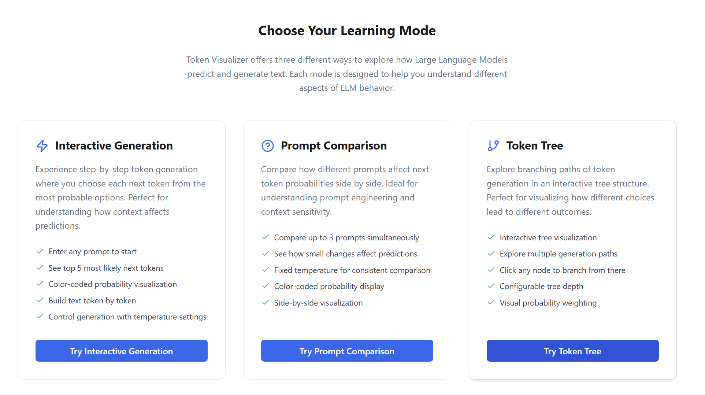
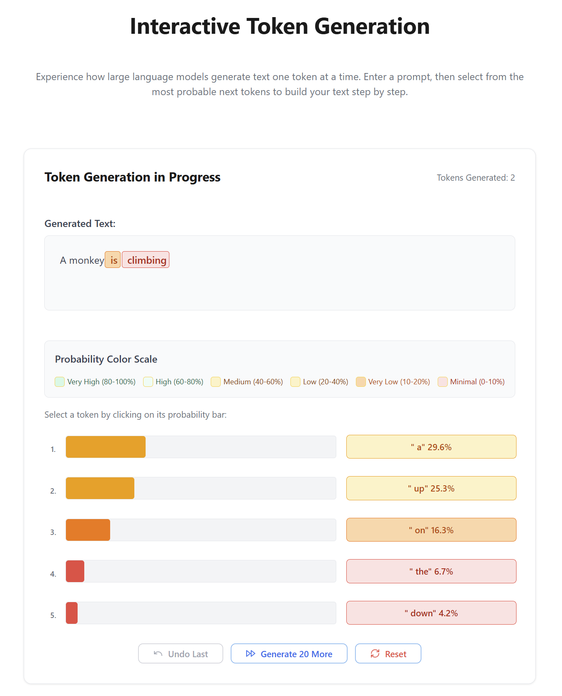
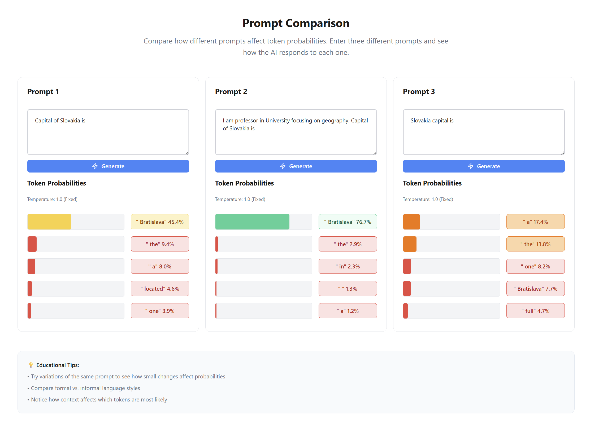
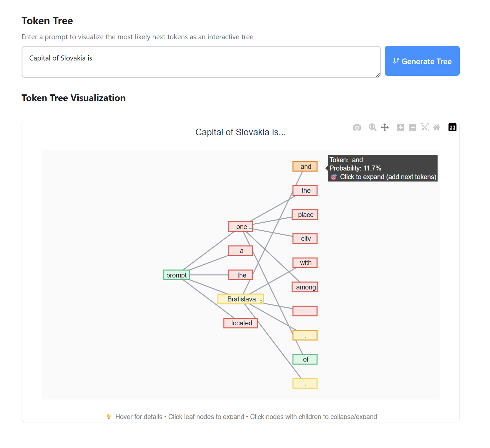

# Token Visualizer

An educational application designed to help students understand autoregressive Large Language Models (LLMs) from the perspective of next token prediction. The application provides interactive visualization of token generation probabilities using a local Gemma 2 model.



## 🎯 Educational Objectives

- **Educational Focus**: Help students understand how LLMs work at the token level
- **Interactive Learning**: Provide hands-on experience with token selection and probability visualization
- **Real-time Feedback**: Show how prompt modifications affect token probabilities
- **Visual Understanding**: Use colors, probabilities, and interactive elements to make abstract concepts concrete

## 🚀 Features

### Mode 1: Interactive Token Generation
Step-by-step token generation where users can select from top 5 probability alternatives at each step.



**Features:**
- Real-time token probability visualization
- Color-coded probability indicators
- Temperature and max tokens configuration
- Token history with backtracking capability
- Educational insights into LLM decision making

### Mode 2: Prompt Comparison
Compare how different prompts affect next-token probabilities side-by-side.



**Features:**
- Three-column comparison layout
- Side-by-side probability analysis
- Fixed temperature for consistent comparison
- Color-coded probability visualization
- Educational prompt engineering insights

### Mode 3: Token Tree Visualization
Advanced tree visualization of multiple token generation paths with interactive branching.



**Features:**
- Interactive tree visualization using Plotly
- Click-to-expand branching paths
- Probability-based color coding
- Network graph representation
- Advanced exploration of generation possibilities

## 🏗️ Architecture

The application consists of two main components:

### Main Application (Reflex Frontend + Backend)
- **Technology**: Python with Reflex Framework
- **Interface**: Web-based interactive UI with modern components
- **Real-time Updates**: Built-in WebSocket communication

### Local LLM Service (FastAPI Microservice)
- **Technology**: Python with FastAPI
- **Model**: Google Gemma 2 2B base model via Hugging Face
- **Inference**: Local GPU/CPU inference (PyTorch)
- **API**: REST API for token generation and probability extraction

> **Detailed architecture:** See [Developer Documentation](docs/DeveloperDocumentation.md)

## 📖 Documentation

## � Local Development

### Prerequisites
- Python 3.12+, 8GB+ RAM, HuggingFace account
- NVIDIA GPU (optional)

### Quick Start
```bash
# Install UV package manager
irm https://astral.sh/uv/install.ps1 | iex  # Windows
curl -LsSf https://astral.sh/uv/install.sh | sh  # macOS/Linux

# Setup
git clone <repository-url>
cd d-ai-token-visualizer
cd token_visualizer && uv sync
cd ../llm_service && uv sync
huggingface-cli login

# Run (2 terminals)
cd llm_service && uv run uvicorn main:app --host 0.0.0.0 --port 8001
cd token_visualizer && uv run reflex run
```

Access: http://localhost:3000

## 📦 Azure Deployment

Deploy to Azure Container Apps with GPU support: **[Terraform Guide](infra/README.md)**

## 📄 License

MIT License - see [LICENSE](LICENSE) file.